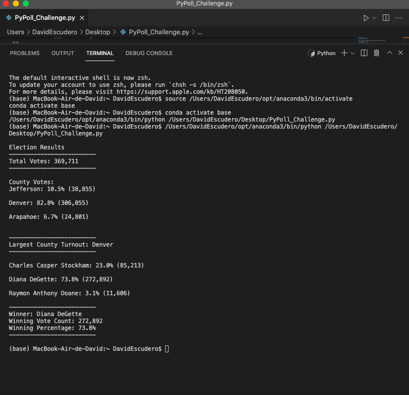

# Election_Analysis
Challenge 3 Election analysis
## Overview of Project
A Colorado Board of elections employee has given you the following tasks to complete the election audit of a recent congressional election
- 1 Calculate the total number of votes cast.
- 2 Get a complete list of candidates who received votes.
- 3 Calculate the total number of votes each candidate received.
- 4 Calculate the percentage of votes each candidate won.
- 5 Determine the winner of the election based on popular vote.
### Resources
- Data Source: election_results.csv
- Software: Python, Visual Studio Code

## Election Audit Results:
- TOTAL VOTES: 369,711
  -CANDIDATES:
    - Charles Casper Stockham
    - Diana DeGette
    - Raymon Anthony Doane
- CANDIDATES RESULTS:
    - Charles Casper Stockham received 23% of the votes, 85,213 in total
    - Diana DeGette received 73.8% of the votes, 272,892 in total
    - Raymon Anthony Doane received 3.1% of the votes, 11,606 in total
- WINNER OF THE ELECTION:
  - Diana DeGette who received 73.8% of the total votes (272,892)
 
 
 
 ```python
 # Add our dependencies.
import csv
import os

# Add a variable to load a file from a path.
file_to_load = os.path.join("/","Users", "DavidEscudero", "Desktop", "Resources", "election_results.csv")

# Add a variable to save the file to a path.
file_to_save = os.path.join("/", "Users", "DavidEscudero", "Desktop", "Election_Analysis", "analysis", "election_analysis.txt")

# Create variables
total_votes = 0
candidate_options = []
candidate_votes = {}
county_options = []
county_votes = {}

# 1: Track the winning candidate, vote count and percentage
winning_candidate = ""
winning_count = 0
winning_percentage = 0

# 2: Track the largest county and county voter turnout.
county_winner = ""
county_winner_count = 0

# Read the csv and convert it into a list of dictionaries
with open(file_to_load) as election_data:
    reader = csv.reader(election_data)

    # Read the header
    header = next(reader)

    # For each row in the CSV file.
    for row in reader:

        # Add to the total vote count
        total_votes = total_votes + 1

        # Get the candidate name from each row.
        candidate_name = row[2]

        # 3: Extract the county name from each row.
        

        # If the candidate does not match any existing candidate add it to
        # the candidate list
        if candidate_name not in candidate_options:

            # Add the candidate name to the candidate list.
            candidate_options.append(candidate_name)

            # And begin tracking that candidate's voter count.
            candidate_votes[candidate_name] = 0

        # Add a vote to that candidate's count
        candidate_votes[candidate_name] += 1

        # 4a: Write an if statement that checks that the
        # county does not match any existing county in the county list.
        county_name = row[1]
        if county_name not in county_options:


            # 4b: Add the existing county to the list of counties.
            county_options.append(county_name) 


            # 4c: Begin tracking the county's vote count.
            county_votes[county_name] = 0


        # 5: Add a vote to that county's vote count.
        county_votes[county_name] += 1


# Save the results to our text file.
with open(file_to_save, "w") as txt_file:

    # Print the final vote count (to terminal)
    election_results = (
        f"\nElection Results\n"
        f"-------------------------\n"
        f"Total Votes: {total_votes:,}\n"
        f"-------------------------\n\n"
        f"County Votes:\n")
    print(election_results, end="")

    txt_file.write(election_results)

    # 6a: Write a for loop to get the county from the county dictionary.
    for county_name in county_votes:

        # 6b: Retrieve the county vote count.
        votes_count = county_votes[county_name]

        # 6c: Calculate the percentage of votes for the county.
        votes_percentage = float(votes_count) / float(total_votes) * 100


        # 6d: Print the county results to the terminal.
        county_results = (f"{county_name}: {votes_percentage:.1f}% ({votes_count:,})\n")
        print(county_results)

        # 6e: Save the county votes to a text file.
        txt_file.write(county_results)

        # 6f: Write an if statement to determine the winning county and get its vote count.
        if (votes_count > county_winner_count):
            county_winner_count = votes_count
            county_winner = county_name


    # 7: Print the county with the largest turnout to the terminal.
    winning_county_summary = (
        f"\n"
        f"-------------------------\n"
        f"Largest County Turnout: {county_winner}\n"
        f"-------------------------\n")
    print(winning_county_summary)

    # 8: Save the county with the largest turnout to a text file.
    txt_file.write(winning_county_summary)

    # Save the final candidate vote count to the text file.
    for candidate_name in candidate_votes:

        # Retrieve vote count and percentage
        votes = candidate_votes.get(candidate_name)
        vote_percentage = float(votes) / float(total_votes) * 100
        candidate_results = (
            f"{candidate_name}: {vote_percentage:.1f}% ({votes:,})\n")

        # Print each candidate's voter count and percentage to the
        # terminal.
        print(candidate_results)
        #  Save the candidate results to our text file.
        txt_file.write(candidate_results)

        # Determine winning vote count, winning percentage, and candidate.
        if (votes > winning_count) and (vote_percentage > winning_percentage):
            winning_count = votes
            winning_candidate = candidate_name
            winning_percentage = vote_percentage

    # Print the winning candidate (to terminal)
    winning_candidate_summary = (
        f"-------------------------\n"
        f"Winner: {winning_candidate}\n"
        f"Winning Vote Count: {winning_count:,}\n"
        f"Winning Percentage: {winning_percentage:.1f}%\n"
        f"-------------------------\n")
    print(winning_candidate_summary)

    # Save the winning candidate's name to the text file
    txt_file.write(winning_candidate_summary)


```
### This is the final code we used to audit the elections, as we can see it is easily modifiable for any data audit.
## Summary:
With this code We were working on throughout all module 3 we are able to perform any voting data analysis, but not only voting data but any "winner" situation, for example if we want to analyse federal elections or office management election, we only have to change the variable county, but also if we want to know which adverse effect of a drug is more present, we only have to change "candidates variable" for "adverse effect" and "county" for "drugs", and so on  
